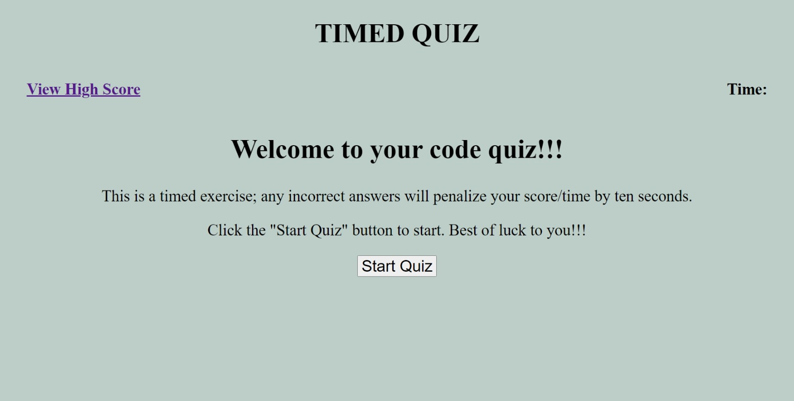
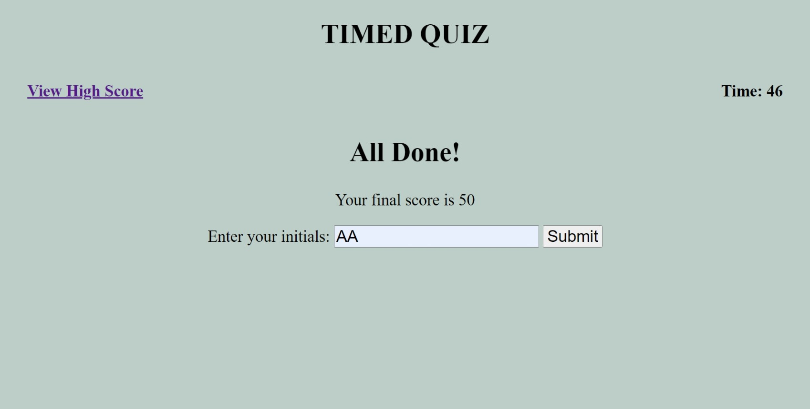

# Timed-Coding-Quiz

## Description

This is a timed coding assessment quiz on JavaScript fundamentals with multiple choice questions.

The quiz runs in the browser and feature dynamically udpated HTML and CSS powered by JavaScript code with a clean, polished, and responsive user interface. 

It stores high scores in local storage.

## Acceptance Criteria
~~~
GIVEN I am taking a code quiz
WHEN I click the start button
THEN a timer starts and I am presented with a question
WHEN I answer a question
THEN I am presented with another question
WHEN I answer a question incorrectly
THEN time is subtracted from the clock
WHEN all questions are answered or the timer reaches 0
THEN the game is over
WHEN the game is over
THEN I can save my initials and my score
~~~

## Website Link

Follow [THIS LINK](https://z20axa.github.io/Timed-Coding-Quiz/)

## Technologies Used

- HTML
- CSS
- JavaScript

## Deployed Website ScreenShot

